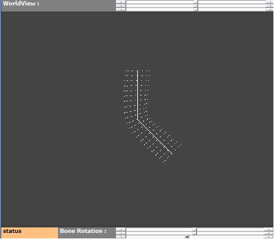



## Vertex Mesh Deformation

### Description

Demonstration of vertex mesh deformation used in character animation.
 
### More Info
 
DirectX8

Should have knowledge of Vertex and Matrix mathematics.

             |
---                |---
**Submitted On**   |2009-09-16 14:15:54
**By**             |[vbinterface](https://github.com/Planet-Source-Code/PSCIndex/blob/master/ByAuthor/vbinterface.md)
**Level**          |Intermediate
**User Rating**    |4.7 (14 globes from 3 users)
**Compatibility**  |VB 6\.0
**Category**       |[Graphics](https://github.com/Planet-Source-Code/PSCIndex/blob/master/ByCategory/graphics__1-46.md)
**World**          |[Visual Basic](https://github.com/Planet-Source-Code/PSCIndex/blob/master/ByWorld/visual-basic.md)
**Archive File**   |[Vertex\_Mes2162619162009\.zip](https://github.com/Planet-Source-Code/vbinterface-vertex-mesh-deformation__1-72460/archive/master.zip)

